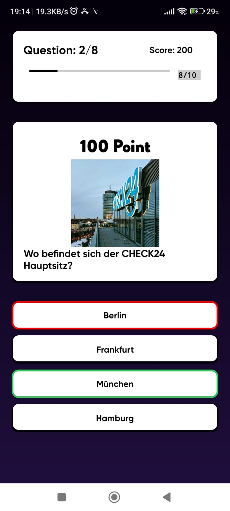

# QuizlerHero

The Quizler Hero - App was created using Kotlin, clean architecture, networking, local caching, threading, jetpack components, and lifecycle-aware components. 


**App features:**
- Main Menu
- Question/Answer Page
  
**Screenshots:**
  <table>
  <tr>
     <td>Main Menu </td>
     <td>Question/Answer Page</td>
  </tr>
  <tr>
    <td></td>
    <td></td>
  </tr>
 </table>


## Code Flow:
```
app
│
├── data
│   ├── local
│   │   ├── shared preference         // For local caching 
│   │
│   ├── remote
│   │   ├── api         // Retrofit API interfaces
│   │
│   ├── model           // Network model and entities
│   │
│   ├── repository      // Repository pattern for data management
│
├── di                  // Dependency Injection setup
│
├── ui
│   ├── common          // Common UI components, extensions, etc.
│   │
│   ├── features
│   │   ├── feature1
│   │   │   ├── view    // Fragments
│   │   │   ├── viewmodel   // ViewModels
│   │   │
│   │   ├── feature2
│
├── utils               // Utility classes and extensions
│
└── QuizApplication.kt     // Application class


```
## Build and Run
- Clone the Repository.
- Build and Run the Project.

## Tech stack - Library:

- [Kotlin](https://kotlinlang.org/)
- [Coroutines](https://github.com/Kotlin/kotlinx.coroutines) - A coroutine is a concurrency design pattern that you can use on Android to simplify code that executes asynchronously.
- [Dagger-Hilt](https://developer.android.com/training/dependency-injection/hilt-android) - for dependency injection.
- JetPack
  - [LiveData](https://developer.android.com/topic/libraries/architecture/livedata) - For reactive style programming (from VM to UI). 
  - [Lifecycle](https://developer.android.com/jetpack/androidx/releases/lifecycle) - Used to get the lifecycle event of an activity or fragment and performs some action in response to change
  - [ViewModel](https://developer.android.com/topic/libraries/architecture/viewmodel) - Stores UI-related data that isn't destroyed on UI changes. 
  - [Jetpack Compose](https://developer.android.com/jetpack/compose) - Modern toolkit for building native UI.
  - [Navigation](https://developer.android.com/guide/navigation/navigation-getting-started) - Used to navigate between fragments
  - [View Binding](https://developer.android.com/topic/libraries/view-binding) - Makes it easier to write code that interacts with views.
- [Material-Components](https://github.com/material-components/material-components-android) - Material design components like ripple animation, cardView.
- [Retrofit](https://github.com/square/retrofit) - Used for REST API communication.
- [Shared-Preferance](https://developer.android.com/training/data-storage/shared-preferences) - used for saving a small collection of key-values


## TODO
- [X] Main Menu 
- [X] Question/Answer page
- [X] Local caching
- [X] Jetpack compose

